# 完整深度学习模型架构文档

涵盖 VAE Decoder 和 WAN 视频生成扩散模型的详细架构、层级说明和数据流转。

---

## 目录
1. [VAE Decoder 架构](#vae-decoder-架构)
2. [WAN 视频生成模型架构](#wan-视频生成模型架构)

---

# VAE Decoder 架构

## 架构图



```mermaid
%%{init: {'theme': 'base', 'themeVariables': { 'primaryColor': '#ffffff', 'primaryBorderColor': '#000', 'fontSize': '9px'}, 'flowchart': {'htmlLabels': true, 'curve': 'basis'}}}%%
graph TD
    INPUT["<b>INPUT: Latent Representation</b><br/>Encoded Image<br/>Shape: [N, z_channels=4, h, w]<br/>Scaled by 0.18215"]
    
    INPUT --> PREPROC["<b>Latent Preprocessing</b><br/>Scale from 0~1 to -1~1<br/>Apply scale_factor"]
    
    PREPROC --> CONV_IN["<b>Conv_in Layer</b><br/>Conv2d(z_channels=4 → ch=128)<br/>kernel=3x3, stride=1, padding=1<br/>OUTPUT: [N, 128, h, w]"]
    
    CONV_IN --> MID_BLOCK["<b>═ MIDDLE BLOCK ═</b>"]
    
    MID_BLOCK --> MID_B1["<b>ResnetBlock.1</b><br/>GroupNorm32(128) → SiLU → Conv2d(128→128)<br/>GroupNorm32(128) → SiLU → Conv2d(128→128)<br/>+ Residual Connection<br/>OUTPUT: [N, 128, h, w]"]
    
    MID_B1 --> MID_ATTN["<b>AttentionBlock</b><br/>GroupNorm32(128)<br/>├─ Q: Linear/Conv1x1(128→128)<br/>├─ K: Linear/Conv1x1(128→128)<br/>├─ V: Linear/Conv1x1(128→128)<br/>├─ Multi-Head Attention (num_heads=1)<br/>└─ Output Proj: Linear/Conv1x1(128→128)<br/>+ Residual Connection<br/>OUTPUT: [N, 128, h, w]"]
    
    MID_ATTN --> MID_B2["<b>ResnetBlock.2</b><br/>GroupNorm32(128) → SiLU → Conv2d(128→128)<br/>GroupNorm32(128) → SiLU → Conv2d(128→128)<br/>+ Residual Connection<br/>OUTPUT: [N, 128, h, w]"]
    
    MID_B2 --> UP_BLOCK["<b>═ UPSAMPLE BLOCKS ═</b><br/>(Reverse of ch_mult=[1,2,4,4])"]
    
    UP_BLOCK --> UP3_START["<b>═ UP LEVEL 3 (i=3, mult=4) ═</b><br/>Processing at ch*4=512 channels"]
    
    UP3_START --> UP3_B0["<b>ResnetBlock.3.0</b><br/>GroupNorm32 → SiLU → Conv2d(128→512)<br/>GroupNorm32 → SiLU → Conv2d(512→512)<br/>+ Residual (Conv1x1 512←128)<br/>OUTPUT: [N, 512, h, w]"]
    
    UP3_B0 --> UP3_B1["<b>ResnetBlock.3.1</b><br/>GroupNorm32 → SiLU → Conv2d(512→512)<br/>GroupNorm32 → SiLU → Conv2d(512→512)<br/>+ Residual Connection<br/>OUTPUT: [N, 512, h, w]"]
    
    UP3_B1 --> UP3_B2["<b>ResnetBlock.3.2</b><br/>GroupNorm32 → SiLU → Conv2d(512→512)<br/>GroupNorm32 → SiLU → Conv2d(512→512)<br/>+ Residual Connection<br/>OUTPUT: [N, 512, h, w]"]
    
    UP3_B2 --> UP3_SAMPLE["<b>UpSampleBlock.3</b><br/>Upsample 2x (repeat)<br/>Conv2d(512→512) kernel=3x3<br/>OUTPUT: [N, 512, 2h, 2w]"]
    
    UP3_SAMPLE --> UP2_START["<b>═ UP LEVEL 2 (i=2, mult=2) ═</b><br/>Processing at ch*2=256 channels"]
    
    UP2_START --> UP2_B0["<b>ResnetBlock.2.0</b><br/>GroupNorm32 → SiLU → Conv2d(512→256)<br/>GroupNorm32 → SiLU → Conv2d(256→256)<br/>+ Residual (Conv1x1 256←512)<br/>OUTPUT: [N, 256, 2h, 2w]"]
    
    UP2_B0 --> UP2_B1["<b>ResnetBlock.2.1</b><br/>GroupNorm32 → SiLU → Conv2d(256→256)<br/>GroupNorm32 → SiLU → Conv2d(256→256)<br/>+ Residual Connection<br/>OUTPUT: [N, 256, 2h, 2w]"]
    
    UP2_B1 --> UP2_B2["<b>ResnetBlock.2.2</b><br/>GroupNorm32 → SiLU → Conv2d(256→256)<br/>GroupNorm32 → SiLU → Conv2d(256→256)<br/>+ Residual Connection<br/>OUTPUT: [N, 256, 2h, 2w]"]
    
    UP2_B2 --> UP2_SAMPLE["<b>UpSampleBlock.2</b><br/>Upsample 2x (repeat)<br/>Conv2d(256→256) kernel=3x3<br/>OUTPUT: [N, 256, 4h, 4w]"]
    
    UP2_SAMPLE --> UP1_START["<b>═ UP LEVEL 1 (i=1, mult=1) ═</b><br/>Processing at ch*1=128 channels"]
    
    UP1_START --> UP1_B0["<b>ResnetBlock.1.0</b><br/>GroupNorm32 → SiLU → Conv2d(256→128)<br/>GroupNorm32 → SiLU → Conv2d(128→128)<br/>+ Residual (Conv1x1 128←256)<br/>OUTPUT: [N, 128, 4h, 4w]"]
    
    UP1_B0 --> UP1_B1["<b>ResnetBlock.1.1</b><br/>GroupNorm32 → SiLU → Conv2d(128→128)<br/>GroupNorm32 → SiLU → Conv2d(128→128)<br/>+ Residual Connection<br/>OUTPUT: [N, 128, 4h, 4w]"]
    
    UP1_B1 --> UP1_B2["<b>ResnetBlock.1.2</b><br/>GroupNorm32 → SiLU → Conv2d(128→128)<br/>GroupNorm32 → SiLU → Conv2d(128→128)<br/>+ Residual Connection<br/>OUTPUT: [N, 128, 4h, 4w]"]
    
    UP1_B2 --> UP1_SAMPLE["<b>UpSampleBlock.1</b><br/>Upsample 2x (repeat)<br/>Conv2d(128→128) kernel=3x3<br/>OUTPUT: [N, 128, 8h, 8w]"]
    
    UP1_SAMPLE --> UP0_START["<b>═ UP LEVEL 0 (i=0, mult=1) ═</b><br/>Processing at ch*1=128 channels"]
    
    UP0_START --> UP0_B0["<b>ResnetBlock.0.0</b><br/>GroupNorm32 → SiLU → Conv2d(128→128)<br/>GroupNorm32 → SiLU → Conv2d(128→128)<br/>+ Residual Connection<br/>OUTPUT: [N, 128, 8h, 8w]"]
    
    UP0_B0 --> UP0_B1["<b>ResnetBlock.0.1</b><br/>GroupNorm32 → SiLU → Conv2d(128→128)<br/>GroupNorm32 → SiLU → Conv2d(128→128)<br/>+ Residual Connection<br/>OUTPUT: [N, 128, 8h, 8w]"]
    
    UP0_B1 --> UP0_B2["<b>ResnetBlock.0.2</b><br/>GroupNorm32 → SiLU → Conv2d(128→128)<br/>GroupNorm32 → SiLU → Conv2d(128→128)<br/>+ Residual Connection<br/>OUTPUT: [N, 128, 8h, 8w]"]
    
    UP0_B2 --> NORM_OUT["<b>Norm_out Layer</b><br/>GroupNorm32(128)<br/>SiLU Activation<br/>OUTPUT: [N, 128, 8h, 8w]"]
    
    NORM_OUT --> CONV_OUT["<b>Conv_out Layer</b><br/>Conv2d(128 → out_ch=3)<br/>kernel=3x3, stride=1, padding=1<br/>OUTPUT: [N, 3, 8h, 8w]"]
    
    CONV_OUT --> POSTPROC["<b>Output Scaling</b><br/>Scale from -1~1 to 0~1<br/>Clamp to [0, 1]"]
    
    POSTPROC --> OUTPUT["<b>OUTPUT: Decoded Image</b><br/>RGB Image<br/>Shape: [N, 3, H=8h, W=8w]<br/>Scale Factor: 8x upsampling"]
    
    style INPUT fill:#b3e5fc,stroke:#01579b,stroke-width:2px
    style OUTPUT fill:#c8e6c9,stroke:#1b5e20,stroke-width:2px
    style MID_BLOCK fill:#fff3e0,stroke:#e65100,stroke-width:2px
    style UP_BLOCK fill:#ffe0b2,stroke:#e65100,stroke-width:2px
    
    style CONV_IN fill:#f3e5f5,stroke:#6a1b9a,stroke-width:2px
    style CONV_OUT fill:#f3e5f5,stroke:#6a1b9a,stroke-width:2px
    
    style MID_B1 fill:#e1bee7,stroke:#6a1b9a,stroke-width:1px
    style MID_B2 fill:#e1bee7,stroke:#6a1b9a,stroke-width:1px
    style MID_ATTN fill:#fce4ec,stroke:#880e4f,stroke-width:2px
    
    style UP3_B0 fill:#e1bee7,stroke:#6a1b9a,stroke-width:1px
    style UP3_B1 fill:#e1bee7,stroke:#6a1b9a,stroke-width:1px
    style UP3_B2 fill:#e1bee7,stroke:#6a1b9a,stroke-width:1px
    
    style UP2_B0 fill:#e1bee7,stroke:#6a1b9a,stroke-width:1px
    style UP2_B1 fill:#e1bee7,stroke:#6a1b9a,stroke-width:1px
    style UP2_B2 fill:#e1bee7,stroke:#6a1b9a,stroke-width:1px
    
    style UP1_B0 fill:#e1bee7,stroke:#6a1b9a,stroke-width:1px
    style UP1_B1 fill:#e1bee7,stroke:#6a1b9a,stroke-width:1px
    style UP1_B2 fill:#e1bee7,stroke:#6a1b9a,stroke-width:1px
    
    style UP0_B0 fill:#e1bee7,stroke:#6a1b9a,stroke-width:1px
    style UP0_B1 fill:#e1bee7,stroke:#6a1b9a,stroke-width:1px
    style UP0_B2 fill:#e1bee7,stroke:#6a1b9a,stroke-width:1px
    
    style UP3_SAMPLE fill:#ffccbc,stroke:#bf360c,stroke-width:2px
    style UP2_SAMPLE fill:#ffccbc,stroke:#bf360c,stroke-width:2px
    style UP1_SAMPLE fill:#ffccbc,stroke:#bf360c,stroke-width:2px
    
    style NORM_OUT fill:#e8f5e9,stroke:#1b5e20,stroke-width:2px
    style PREPROC fill:#e0f2f1,stroke:#00695c,stroke-width:1px
    style POSTPROC fill:#e0f2f1,stroke:#00695c,stroke-width:1px
```

## VAE 详细说明

### 整体流程
```
Latent [N, 4, h, w]
    ↓ (缩放)
Conv_in(4→128)
    ↓
Middle Block (128)
    ├─ ResnetBlock(128→128)
    ├─ AttentionBlock(128)
    └─ ResnetBlock(128→128)
    ↓
Upsample Layers (向上采样器)
    ├─ Level 3: [512, h, w] → [512, 2h, 2w]
    ├─ Level 2: [256, 2h, 2w] → [256, 4h, 4w]
    ├─ Level 1: [128, 4h, 4w] → [128, 8h, 8w]
    └─ Level 0: [128, 8h, 8w]（无upsample）
    ↓
Norm_out + Conv_out(128→3)
    ↓
Output [N, 3, 8h, 8w]
```

### ResnetBlock 结构
```
输入 x: [N, in_channels, h, w]
    ↓
GroupNorm32(in_channels)
    ↓
SiLU 激活函数
    ↓
Conv2d(in_channels → out_channels, kernel=3x3, padding=1)
    ↓
GroupNorm32(out_channels)
    ↓
SiLU 激活函数
    ↓
Conv2d(out_channels → out_channels, kernel=3x3, padding=1)
    ↓
如果 in_channels ≠ out_channels:
    使用 Conv1x1 处理 shortcut 连接
    ↓
残差连接: 输出 + shortcut(x)
```

### AttentionBlock 结构
```
输入 x: [N, in_channels, h, w]
    ↓
GroupNorm32(in_channels)
    ↓
Reshape to [N, h*w, in_channels]（如果用Linear）
    ↓
多头自注意力机制:
    ├─ Q = Linear/Conv1x1(in_channels → in_channels)
    ├─ K = Linear/Conv1x1(in_channels → in_channels)
    ├─ V = Linear/Conv1x1(in_channels → in_channels)
    ├─ Attention = Softmax(Q·K^T / √d) · V
    └─ Output = Linear/Conv1x1(in_channels → in_channels)
    ↓
Reshape back to [N, in_channels, h, w]（如果用Linear）
    ↓
残差连接: 输出 + x
```

### 通道维度变化
- **输入**: [N, 4, h, w]
- **Conv_in**: [N, 128, h, w]
- **中间块**: [N, 128, h, w]
- **Level 3**: [N, 512, h, w] → [N, 512, 2h, 2w]
- **Level 2**: [N, 256, 2h, 2w] → [N, 256, 4h, 4w]
- **Level 1**: [N, 128, 4h, 4w] → [N, 128, 8h, 8w]
- **Level 0**: [N, 128, 8h, 8w]
- **输出**: [N, 3, 8h, 8w]

---

# WAN 视频生成模型架构

## 架构图



```mermaid
%%{init: {'theme': 'base', 'themeVariables': { 'primaryColor': '#ffffff', 'primaryBorderColor': '#000', 'fontSize': '8px'}, 'flowchart': {'htmlLabels': true, 'curve': 'basis', 'nodeSpacing': 50, 'rankSpacing': 60}}}%%
graph TD
    ENTRY["START"]
    XIN["<b>INPUT: Noisy Latents</b><br/>x: [N*C, T, H, W]<br/>C=patch_size_t*patch_h*patch_w<br/>T=temporal, H=height, W=width"]
    TIN["<b>Timesteps</b><br/>timesteps: [N]"]
    CTXIN["<b>Text Context</b><br/>context: [N, L_text, text_dim=4096]"]
    YIN["<b>Clip Features I2V</b><br/>y: [N, 257, 1280]<br/>(optional)"]
    CCAT["<b>Channel Concat</b><br/>c_concat (optional)"]
    VACEIN["<b>VACE Context</b><br/>vace_context (optional)"]
    VS["vace_strength"]
    
    ENTRY --> INPUTS["<b>Gather Inputs</b>"]
    XIN --> INPUTS
    TIN --> INPUTS
    CTXIN --> INPUTS
    YIN --> INPUTS
    CCAT --> INPUTS
    VACEIN --> INPUTS
    VS --> INPUTS
    
    INPUTS --> COMPUTE["WAN::WanRunner::compute()"]
    
    COMPUTE --> GRAPH["build_graph() + compute()"]
    
    GRAPH --> MKTIN["<b>Make Input Tensors</b><br/>x [N*C, T, H, W]<br/>timesteps [N]"]
    GRAPH --> PEGEN["<b>RoPE Positional Encoding</b><br/>Rope::gen_wan_pe()<br/>θ=10000, axes_dim=[44,42,42]<br/>OUTPUT: pe [pos_len, 64, 2, 2]"]
    GRAPH --> CCCHECK{"c_concat<br/>not null?"}
    
    CCCHECK -->|yes| CCONCAT["<b>Channel Concat</b><br/>ggml_concat(x, c_concat)<br/>OUTPUT: [N*C_new, T, H, W]"]
    CCCHECK -->|no| FORWARD["Wan::forward_orig()"]
    CCONCAT --> FORWARD
    MKTIN --> FORWARD
    PEGEN --> FORWARD
    
    FORWARD --> PAD["<b>Pad to Patch Size</b><br/>Pad T,H,W to multiples<br/>of [patch_t=1, patch_h=2, patch_w=2]"]
    
    PAD --> PATCH3D["<b>3D Patch Embedding</b><br/>Conv3d(in_dim=16 → 2048)<br/>kernel=patch, stride=patch<br/>OUTPUT: [N, 2048, T, H, W]"]
    
    PATCH3D --> RS1["<b>Reshape & Permute</b><br/>[N, 2048, n_tokens]<br/>→ [N, n_tokens, 2048]<br/>x_tokens [N, n_tokens, dim]"]
    
    PATCH3D --> TEMB["<b>Timestep Embedding</b>"]
    TEMB --> TE1["Freq Embedding (freq_dim=256)"]
    TE1 --> TE2["Linear(256 → 2048)"]
    TE2 --> TE3["SiLU"]
    TE3 --> TE4["Linear(2048 → 2048)"]
    TE4 --> TE5["SiLU"]
    TE5 --> TE6["Linear(2048 → 6*2048)<br/>e_embed [N, 6, 2048]"]
    
    PATCH3D --> TXTEMB["<b>Text Embedding</b>"]
    TXTEMB --> TX1["Linear(4096 → 2048)"]
    TX1 --> TX2["GELU"]
    TX2 --> TX3["Linear(2048 → 2048)<br/>context_txt [N, L, 2048]"]
    
    YIN --> I2VCHECK{"model_type<br/>== I2V?"}
    I2VCHECK -->|yes| IMG_EMBED["<b>Image Embedding</b><br/>MLPProj(1280 → 2048)<br/>├─ LayerNorm<br/>├─ Linear<br/>├─ GELU<br/>├─ Linear<br/>└─ LayerNorm"]
    I2VCHECK -->|no| TXT_ONLY["context_img = None"]
    
    IMG_EMBED --> CTXCAT["context = cat(img, txt)<br/>[N, Limg+Ltxt, 2048]"]
    TXT_ONLY --> CTX_FINAL["context = txt<br/>[N, L_text, 2048]"]
    
    CTXCAT --> MAINLOOP["<b>═ Main Transformer ═</b><br/>num_layers=32"]
    CTX_FINAL --> MAINLOOP
    RS1 --> MAINLOOP
    TE6 --> MAINLOOP
    
    MAINLOOP --> EMOD["<b>Embedding Modulation</b><br/>chunk e → [es0, es1, es2, es3, es4, es5]"]
    
    EMOD --> SA["<b>═ SELF-ATTENTION ═</b>"]
    
    SA --> SA_LN["LayerNorm(x)"]
    SA_LN --> SA_SCALE["x = x + mul(x, es1)<br/>x = x + es0"]
    SA_SCALE --> SA_QKV["Q,K,V projections + RMSNorm"]
    SA_QKV --> SA_ATTN["RoPE Multi-Head Attention<br/>(16 heads, dim=128)"]
    SA_ATTN --> SA_OUT["Output Projection<br/>Linear(2048 → 2048)"]
    SA_OUT --> SA_RES["x = x + out * es2"]
    
    SA_RES --> CA["<b>═ CROSS-ATTENTION ═</b>"]
    
    CA --> CA_LN["LayerNorm(x)"]
    
    CA_LN --> CA_TYPE{"T2V<br/>or I2V?"}
    
    CA_TYPE -->|T2V| CA_T2V["<b>T2V Cross-Attention</b><br/>Q from x, K/V from context<br/>16 heads"]
    CA_TYPE -->|I2V| CA_I2V["<b>I2V Cross-Attention</b><br/>Split context_img + context_txt<br/>Dual attention merge"]
    
    CA_T2V --> CA_T_OUT["Output Projection"]
    CA_I2V --> CA_I_OUT["Output Projection"]
    
    CA_T_OUT --> CA_RES["x = x + out"]
    CA_I_OUT --> CA_RES
    
    CA_RES --> FFN["<b>═ FFN BLOCK ═</b>"]
    
    FFN --> FFN_LN["LayerNorm(x)"]
    FFN_LN --> FFN_SCALE["x = x + mul(x, es4)<br/>x = x + es3"]
    FFN_SCALE --> FFN_UP["Linear(2048 → 8192) + GELU"]
    FFN_UP --> FFN_DOWN["Linear(8192 → 2048)"]
    FFN_DOWN --> FFN_RES["x = x + out * es5"]
    
    FFN_RES --> VACE_CHK{"i in<br/>vace_layers?"}
    
    VACE_CHK -->|yes| VACE_BLK["<b>VACE Block</b><br/>Temporal spatial fusion<br/>c_tokens → WanAttention"]
    VACE_CHK -->|no| NEXTI["Next Block"]
    
    VACE_BLK --> VB_SKIP["c_skip = Linear(c)<br/>x = x + c_skip*strength"]
    VB_SKIP --> NEXTI
    
    NEXTI -->|continue| EMOD
    NEXTI -->|end| HEAD
    
    HEAD["<b>═ OUTPUT HEAD ═</b>"]
    
    HEAD --> H_LN["LayerNorm(x)"]
    H_LN --> H_SCALE["Apply final modulation"]
    H_SCALE --> H_LIN["Linear(2048 → out*patch_prod)"]
    H_LIN --> UNPATCH["Unpatchify<br/>[N*out, T, H, W]"]
    UNPATCH --> SLICE["Slice to original size"]
    SLICE --> OUTPUT["<b>OUTPUT: Denoised Latents</b><br/>[N*out, T, H, W]"]
    
    style ENTRY fill:#b3e5fc,stroke:#01579b,stroke-width:2px
    style OUTPUT fill:#c8e6c9,stroke:#1b5e20,stroke-width:2px
    style MAINLOOP fill:#fff3e0,stroke:#e65100,stroke-width:2px
    style SA fill:#e1bee7,stroke:#6a1b9a,stroke-width:2px
    style CA fill:#ffccbc,stroke:#bf360c,stroke-width:2px
    style FFN fill:#ffccbc,stroke:#bf360c,stroke-width:2px
    style HEAD fill:#e8f5e9,stroke:#1b5e20,stroke-width:2px
    style VACE_BLK fill:#fce4ec,stroke:#880e4f,stroke-width:2px
```

## WAN 详细说明

### 核心参数配置
```
WAN 2.x 参数:
├─ in_dim: 16 (输入维度)
├─ dim: 2048 (隐藏维度)
├─ ffn_dim: 8192 (FFN中间维度)
├─ num_layers: 32 (Transformer块数)
├─ num_heads: 16 (注意力头数)
├─ head_dim: 128 (per-head维度 = 2048/16)
├─ text_dim: 4096 (输入文本嵌入维度)
├─ patch_size: [1, 2, 2] (时间, 高度, 宽度)
├─ theta: 10000 (RoPE频率基数)
└─ axes_dim: [44, 42, 42] (RoPE轴维度)
```

### 完整数据流

```
输入1: x [N*C, T, H, W]  (C = patch_prod)
输入2: timesteps [N]
输入3: context [N, L_text, 4096] (可选: y [N, 257, 1280] for I2V)

║
╠═══ Conv3d Patch Embedding ═══╗
║    Kernel=[1,2,2], Stride=[1,2,2]
║    in_dim=16 → 2048            ║
║    Reshape/Permute              ║
║    OUTPUT: x_tokens [N, n_tokens, 2048]
║
╠═══ Time Embedding ═════════════╗
║    Freq → Linear → SiLU → Linear → SiLU → Linear
║    OUTPUT: e_embed [N, 6, 2048]
║
╠═══ Text Embedding ═════════════╗
║    Linear(4096→2048) → GELU → Linear
║    OUTPUT: context_txt [N, L_text, 2048]
║    (可选) Image Embedding for I2V
║    OUTPUT: context [N, L_img+L_txt, 2048]
║
╠═══ 32× Transformer Blocks ═════╗
║
║  每个Block:
║  ├─ Self-Attention (16 heads)
║  │  ├─ Q,K,V: Linear + RMSNorm
║  │  ├─ RoPE Attention
║  │  └─ Output + Residual
║  │
║  ├─ Cross-Attention
║  │  ├─ T2V: 单路文本注意力
║  │  ├─ I2V: 图文双路融合
║  │  └─ Output + Residual
║  │
║  ├─ FFN
║  │  ├─ Linear(2048→8192) + GELU
║  │  ├─ Linear(8192→2048)
║  │  └─ Output + Residual
║  │
║  └─ VACE (可选) 时空融合
║
║ 所有子块使用时间嵌入调制
║ [es0, es1, es2, es3, es4, es5]
║
╠═══ Output Head ════════════════╗
║    LayerNorm + Modulation
║    Linear: 2048 → out*patch_prod
║    Unpatchify: reshape & permute
║    Slice: [0:T, 0:H, 0:W]
║
OUTPUT: [N*out, T, H, W]
```

### Self-Attention Block 详解
```
输入: x [N, n_tokens, 2048]

LayerNorm(x) + Modulation:
    y = x + es0 (bias)
    y = y * (1 + es1) (scale)

Q,K,V 投影 + RMSNorm:
    Q = Linear(y, 2048→2048) + RMSNorm
    K = Linear(y, 2048→2048) + RMSNorm
    V = Linear(y, 2048→2048)
    
    Reshape: [N, n_tokens, 16, 128]

RoPE Attention:
    scores = Q @ K^T / √128 + RoPE_bias
    weights = Softmax(scores)
    output = weights @ V             [N, n_tokens, 16, 128]
    Reshape: [N, n_tokens, 2048]

输出投影:
    output = Linear(2048→2048)
    
残差连接:
    x = x + output * es2 (residual scale)
```

### Cross-Attention Block (T2V) 详解
```
输入: x_query [N, n_tokens, 2048]
     context [N, L_text, 2048]

Query from x:
    Q = Linear(x, 2048→2048) + RMSNorm [N, n_tokens, 16, 128]

Key/Value from context:
    K = Linear(context, 2048→2048) + RMSNorm [N, L_text, 16, 128]
    V = Linear(context, 2048→2048)         [N, L_text, 16, 128]

Cross-Attention:
    scores = Q @ K^T / √128
    weights = Softmax(scores)             [N, n_tokens, L_text]
    output = weights @ V                  [N, n_tokens, 16, 128]
    Reshape: [N, n_tokens, 2048]

输出投影 + 残差:
    x = x + Linear(output, 2048→2048)
```

### Cross-Attention Block (I2V) 详解
```
输入: x [N, n_tokens, 2048]
     context_img [N, 257, 2048]
     context_txt [N, L_text, 2048]

Query:
    Q = Linear(x, 2048→2048) + RMSNorm

双路Attention:
    attn_img = Attention(Q, context_img)  [N, n_tokens, 16, 128]
    attn_txt = Attention(Q, context_txt)  [N, n_tokens, 16, 128]

融合:
    output = attn_img + attn_txt          [N, n_tokens, 16, 128]
    Reshape: [N, n_tokens, 2048]
    
残差:
    x = x + Linear(output, 2048→2048)
```

### FFN Block 详解
```
输入: x [N, n_tokens, 2048]

LayerNorm + Modulation:
    y = LayerNorm(x)
    y = y + es3 (bias)
    y = y * (1 + es4) (scale)

MLP 扩展-收缩:
    up = Linear(y, 2048→8192)             [N, n_tokens, 8192]
    activated = GELU(up, approx='tanh')   [N, n_tokens, 8192]
    down = Linear(activated, 8192→2048)   [N, n_tokens, 2048]

残差连接:
    x = x + down * es5 (residual scale)
```

### 时间嵌入调制 (Modulation)

每个Transformer Block的时间嵌入被分解为6个分量 `[es0, es1, es2, es3, es4, es5]`：

| 分量 | 用途 | 包含 |
|------|------|------|
| es0 | Self-Attention 偏置 | 加到归一化后的x |
| es1 | Self-Attention 缩放 | 乘以归一化后的x |
| es2 | Self-Attention 残差缩放 | 乘以SA输出 |
| es3 | FFN 偏置 | 加到归一化后的x |
| es4 | FFN 缩放 | 乘以归一化后的x |
| es5 | FFN 残差缩放 | 乘以FFN输出 |

### VACE 时空融合 (可选)

当启用VACE时，在特定Transformer块处：

```
vace_context [N*vace_in, T, H, W]
    ↓ Conv3d Patch Embedding
    ↓ reshape & permute
c_tokens [N, n_token_vace, 2048]

VaceWanAttentionBlock:
├─ block_id==0? c_before = Linear(c)
├─ WanAttentionBlock(c, e, pe, context)
├─ c_skip = Linear_after(c)
├─ c_skip *= vace_strength
└─ x = x + c_skip
```

### 输出生成流程

```
最后的 x [N, n_tokens, dim]
    ↓ LayerNorm + 最终Modulation
    ↓ Linear: dim → out_dim * patch_prod
        其中 patch_prod = patch_t * patch_h * patch_w
    ↓ Unpatchify:
        Reshape & Permute 到 [N*out_dim, T_pad, H_pad, W_pad]
    ↓ Slice:
        [0:T, 0:H, 0:W]
    ↓ 输出 [N*out_dim, T, H, W]
        Denoised latents 准备进入下一步采样器
```

---

## 模型变体对比

| 模型 | in_dim | dim | ffn_dim | heads | z_ch | 用途 |
|------|--------|------|---------|-------|------|------|
| **WAN 2.0** | 16 | 2048 | 8192 | 16 | 16 | Text-to-Video |
| **WAN 2.1** | 16 | 2048 | 8192 | 16 | 16 | T2V + I2V混合 |
| **WAN 2.2** | 16 | 2048 | 8192 | 16 | 16 | 改进T2V+I2V |
| **SD 1.x** | - | 128 | 320/640 | 8 | 4 | Text-to-Image |
| **SDXL** | - | (UNet) | - | 8/16 | 4 | High-res T2I |
| **Flux** | 32 | 2048 | 5333 | 16 | 32 | Flow matching T2I |

---

## 代码路径参考

- **WAN Decoder**: [src/wan.hpp](src/wan.hpp)
- **VAE Models**: [src/auto_encoder_kl.hpp](src/auto_encoder_kl.hpp)
- **Diffusion Model Interface**: [src/diffusion_model.hpp](src/diffusion_model.hpp)
- **Main Compute**: [src/stable-diffusion.cpp](src/stable-diffusion.cpp)
