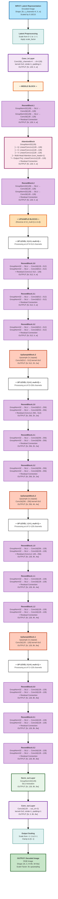

```mermaid
%%{init: {'theme': 'base', 'themeVariables': { 'primaryColor': '#ffffff', 'primaryBorderColor': '#000', 'fontSize': '9px'}, 'flowchart': {'htmlLabels': true, 'curve': 'basis'}}}%%
graph TD
    INPUT["<b>INPUT: Latent Representation</b><br/>Encoded Image<br/>Shape: [N, z_channels=4, h, w]<br/>Scaled by 0.18215"]
    
    INPUT --> PREPROC["<b>Latent Preprocessing</b><br/>Scale from 0~1 to -1~1<br/>Apply scale_factor"]
    
    PREPROC --> CONV_IN["<b>Conv_in Layer</b><br/>Conv2d(z_channels=4 → ch=128)<br/>kernel=3x3, stride=1, padding=1<br/>OUTPUT: [N, 128, h, w]"]
    
    CONV_IN --> MID_BLOCK["<b>═ MIDDLE BLOCK ═</b>"]
    
    MID_BLOCK --> MID_B1["<b>ResnetBlock.1</b><br/>GroupNorm32(128) → SiLU → Conv2d(128→128)<br/>GroupNorm32(128) → SiLU → Conv2d(128→128)<br/>+ Residual Connection<br/>OUTPUT: [N, 128, h, w]"]
    
    MID_B1 --> MID_ATTN["<b>AttentionBlock</b><br/>GroupNorm32(128)<br/>├─ Q: Linear/Conv1x1(128→128)<br/>├─ K: Linear/Conv1x1(128→128)<br/>├─ V: Linear/Conv1x1(128→128)<br/>├─ Multi-Head Attention (num_heads=1)<br/>└─ Output Proj: Linear/Conv1x1(128→128)<br/>+ Residual Connection<br/>OUTPUT: [N, 128, h, w]"]
    
    MID_ATTN --> MID_B2["<b>ResnetBlock.2</b><br/>GroupNorm32(128) → SiLU → Conv2d(128→128)<br/>GroupNorm32(128) → SiLU → Conv2d(128→128)<br/>+ Residual Connection<br/>OUTPUT: [N, 128, h, w]"]
    
    MID_B2 --> UP_BLOCK["<b>═ UPSAMPLE BLOCKS ═</b><br/>(Reverse of ch_mult=[1,2,4,4])"]
    
    UP_BLOCK --> UP3_START["<b>═ UP LEVEL 3 (i=3, mult=4) ═</b><br/>Processing at ch*4=512 channels"]
    
    UP3_START --> UP3_B0["<b>ResnetBlock.3.0</b><br/>GroupNorm32 → SiLU → Conv2d(128→512)<br/>GroupNorm32 → SiLU → Conv2d(512→512)<br/>+ Residual (Conv1x1 512←128)<br/>OUTPUT: [N, 512, h, w]"]
    
    UP3_B0 --> UP3_B1["<b>ResnetBlock.3.1</b><br/>GroupNorm32 → SiLU → Conv2d(512→512)<br/>GroupNorm32 → SiLU → Conv2d(512→512)<br/>+ Residual Connection<br/>OUTPUT: [N, 512, h, w]"]
    
    UP3_B1 --> UP3_B2["<b>ResnetBlock.3.2</b><br/>GroupNorm32 → SiLU → Conv2d(512→512)<br/>GroupNorm32 → SiLU → Conv2d(512→512)<br/>+ Residual Connection<br/>OUTPUT: [N, 512, h, w]"]
    
    UP3_B2 --> UP3_SAMPLE["<b>UpSampleBlock.3</b><br/>Upsample 2x (repeat)<br/>Conv2d(512→512) kernel=3x3<br/>OUTPUT: [N, 512, 2h, 2w]"]
    
    UP3_SAMPLE --> UP2_START["<b>═ UP LEVEL 2 (i=2, mult=2) ═</b><br/>Processing at ch*2=256 channels"]
    
    UP2_START --> UP2_B0["<b>ResnetBlock.2.0</b><br/>GroupNorm32 → SiLU → Conv2d(512→256)<br/>GroupNorm32 → SiLU → Conv2d(256→256)<br/>+ Residual (Conv1x1 256←512)<br/>OUTPUT: [N, 256, 2h, 2w]"]
    
    UP2_B0 --> UP2_B1["<b>ResnetBlock.2.1</b><br/>GroupNorm32 → SiLU → Conv2d(256→256)<br/>GroupNorm32 → SiLU → Conv2d(256→256)<br/>+ Residual Connection<br/>OUTPUT: [N, 256, 2h, 2w]"]
    
    UP2_B1 --> UP2_B2["<b>ResnetBlock.2.2</b><br/>GroupNorm32 → SiLU → Conv2d(256→256)<br/>GroupNorm32 → SiLU → Conv2d(256→256)<br/>+ Residual Connection<br/>OUTPUT: [N, 256, 2h, 2w]"]
    
    UP2_B2 --> UP2_SAMPLE["<b>UpSampleBlock.2</b><br/>Upsample 2x (repeat)<br/>Conv2d(256→256) kernel=3x3<br/>OUTPUT: [N, 256, 4h, 4w]"]
    
    UP2_SAMPLE --> UP1_START["<b>═ UP LEVEL 1 (i=1, mult=1) ═</b><br/>Processing at ch*1=128 channels"]
    
    UP1_START --> UP1_B0["<b>ResnetBlock.1.0</b><br/>GroupNorm32 → SiLU → Conv2d(256→128)<br/>GroupNorm32 → SiLU → Conv2d(128→128)<br/>+ Residual (Conv1x1 128←256)<br/>OUTPUT: [N, 128, 4h, 4w]"]
    
    UP1_B0 --> UP1_B1["<b>ResnetBlock.1.1</b><br/>GroupNorm32 → SiLU → Conv2d(128→128)<br/>GroupNorm32 → SiLU → Conv2d(128→128)<br/>+ Residual Connection<br/>OUTPUT: [N, 128, 4h, 4w]"]
    
    UP1_B1 --> UP1_B2["<b>ResnetBlock.1.2</b><br/>GroupNorm32 → SiLU → Conv2d(128→128)<br/>GroupNorm32 → SiLU → Conv2d(128→128)<br/>+ Residual Connection<br/>OUTPUT: [N, 128, 4h, 4w]"]
    
    UP1_B2 --> UP1_SAMPLE["<b>UpSampleBlock.1</b><br/>Upsample 2x (repeat)<br/>Conv2d(128→128) kernel=3x3<br/>OUTPUT: [N, 128, 8h, 8w]"]
    
    UP1_SAMPLE --> UP0_START["<b>═ UP LEVEL 0 (i=0, mult=1) ═</b><br/>Processing at ch*1=128 channels"]
    
    UP0_START --> UP0_B0["<b>ResnetBlock.0.0</b><br/>GroupNorm32 → SiLU → Conv2d(128→128)<br/>GroupNorm32 → SiLU → Conv2d(128→128)<br/>+ Residual Connection<br/>OUTPUT: [N, 128, 8h, 8w]"]
    
    UP0_B0 --> UP0_B1["<b>ResnetBlock.0.1</b><br/>GroupNorm32 → SiLU → Conv2d(128→128)<br/>GroupNorm32 → SiLU → Conv2d(128→128)<br/>+ Residual Connection<br/>OUTPUT: [N, 128, 8h, 8w]"]
    
    UP0_B1 --> UP0_B2["<b>ResnetBlock.0.2</b><br/>GroupNorm32 → SiLU → Conv2d(128→128)<br/>GroupNorm32 → SiLU → Conv2d(128→128)<br/>+ Residual Connection<br/>OUTPUT: [N, 128, 8h, 8w]"]
    
    UP0_B2 --> NORM_OUT["<b>Norm_out Layer</b><br/>GroupNorm32(128)<br/>SiLU Activation<br/>OUTPUT: [N, 128, 8h, 8w]"]
    
    NORM_OUT --> CONV_OUT["<b>Conv_out Layer</b><br/>Conv2d(128 → out_ch=3)<br/>kernel=3x3, stride=1, padding=1<br/>OUTPUT: [N, 3, 8h, 8w]"]
    
    CONV_OUT --> POSTPROC["<b>Output Scaling</b><br/>Scale from -1~1 to 0~1<br/>Clamp to [0, 1]"]
    
    POSTPROC --> OUTPUT["<b>OUTPUT: Decoded Image</b><br/>RGB Image<br/>Shape: [N, 3, H=8h, W=8w]<br/>Scale Factor: 8x upsampling"]
    
    style INPUT fill:#b3e5fc,stroke:#01579b,stroke-width:2px
    style OUTPUT fill:#c8e6c9,stroke:#1b5e20,stroke-width:2px
    style MID_BLOCK fill:#fff3e0,stroke:#e65100,stroke-width:2px
    style UP_BLOCK fill:#ffe0b2,stroke:#e65100,stroke-width:2px
    
    style CONV_IN fill:#f3e5f5,stroke:#6a1b9a,stroke-width:2px
    style CONV_OUT fill:#f3e5f5,stroke:#6a1b9a,stroke-width:2px
    
    style MID_B1 fill:#e1bee7,stroke:#6a1b9a,stroke-width:1px
    style MID_B2 fill:#e1bee7,stroke:#6a1b9a,stroke-width:1px
    style MID_ATTN fill:#fce4ec,stroke:#880e4f,stroke-width:2px
    
    style UP3_B0 fill:#e1bee7,stroke:#6a1b9a,stroke-width:1px
    style UP3_B1 fill:#e1bee7,stroke:#6a1b9a,stroke-width:1px
    style UP3_B2 fill:#e1bee7,stroke:#6a1b9a,stroke-width:1px
    
    style UP2_B0 fill:#e1bee7,stroke:#6a1b9a,stroke-width:1px
    style UP2_B1 fill:#e1bee7,stroke:#6a1b9a,stroke-width:1px
    style UP2_B2 fill:#e1bee7,stroke:#6a1b9a,stroke-width:1px
    
    style UP1_B0 fill:#e1bee7,stroke:#6a1b9a,stroke-width:1px
    style UP1_B1 fill:#e1bee7,stroke:#6a1b9a,stroke-width:1px
    style UP1_B2 fill:#e1bee7,stroke:#6a1b9a,stroke-width:1px
    
    style UP0_B0 fill:#e1bee7,stroke:#6a1b9a,stroke-width:1px
    style UP0_B1 fill:#e1bee7,stroke:#6a1b9a,stroke-width:1px
    style UP0_B2 fill:#e1bee7,stroke:#6a1b9a,stroke-width:1px
    
    style UP3_SAMPLE fill:#ffccbc,stroke:#bf360c,stroke-width:2px
    style UP2_SAMPLE fill:#ffccbc,stroke:#bf360c,stroke-width:2px
    style UP1_SAMPLE fill:#ffccbc,stroke:#bf360c,stroke-width:2px
    
    style NORM_OUT fill:#e8f5e9,stroke:#1b5e20,stroke-width:2px
    style PREPROC fill:#e0f2f1,stroke:#00695c,stroke-width:1px
    style POSTPROC fill:#e0f2f1,stroke:#00695c,stroke-width:1px
```

